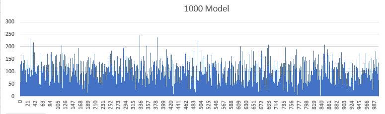
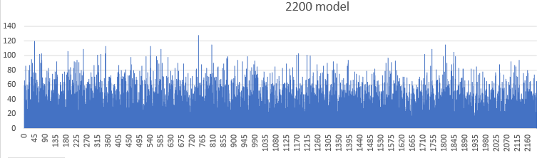

##   Georgia Tech Bootcamp Final Project - Song Finder 

This is the Final Project for our Data Analytics Bootcamp

Original Data from: https://www.kaggle.com/yamaerenay/spotify-dataset-19212020-160k-tracks?select=data.csv

#### Overview

<!-- The SongFinder is a Heroku hosted site designed to allow the user to select an artist and song to recive a list of musically similar songs. -->
The SongFinder is a Heroku hosted site that allows the user to get music recommendations by inputting a specific artist and subsequently selecting a song from that artist.

Machine Learning kMeans Clustering was used to group almost 100K songs into clusters. The cluster-id assigned in the kMeans clustering became the queried field to find and return songs to the user.

The site can be accessed at: https://songfinder-finalproject.herokuapp.com/

#### Programs and Libraries Used

 - Jupyter notebook - Python:
 > import numpy as np  
 > import pandas as pd  
 > import psycopg2   
 > from sklearn.cluster import KMeans  
 > import matplotlib.pyplot as plt  
 > import sqlalchemy  
 > from sqlalchemy.ext.automap import automap_base  
 > from sqlalchemy.orm import Session  
 > from sqlalchemy import create_engine, func, inspect, desc  
 > from config import username, password  
 > import io  
    
 - Flask w/SQLALchemy
 - Postgres
 - Javascript, D3
 - HTML w/Bootstrap, CSS
 - Tableau Public
 
 

#### Machine Learning 

> Machine Learning is a trending topic in business today.
<!-- > Businesses want to predict customer wants and curate to their needs to make the buying process better for both.   -->
> Businesses use machine learning to predict customer's needs and behaviors so that they can create a more beneficial consumer experience while benefitting the business and the customer. 
> This project uses kMeans clustering Machine Learning to power a web app. 
<!-- > This web-app provides the user with a song list to explore based on musical characteristics of a song they choose. -->
>This web app lets the user discover new music based on the musical characteristics of their chosen track.

##### The following  paragraphs highlight this process in the context of machine learning with Spotify music data

#####   How Spotify Learns vs kMeans Model
  
  |Model|Supervised?|Audio Characteristics|User Input|NLP|Summary|
|:-----|:----:|:----:|:----:|:----:|:----:|
|Spotify |Yes |Yes |Yes |Yes |Multiple inputs, individualized
|SongFinder|No |Yes |No |No|kMeans Clustering by Music characteristics, generalized

### Spotify uses all of these. SongFinder only uses Spotify Raw Audio Analyzation data.

##### Natural Language Processing
> Analyses the language, lyrics and content of a song.

##### Raw Audio Analyzation
> Detects the “vibe” or “mood” of a song’s audio and decides whether it’s upbeat, chill, heavy, minimal, instrumental etc... 

##### Collaborative Filtering
<!-- > Compares new songs to a listener’s current habits to decide what will suit their tastes. -->
> Compares songs in the database to the user's current input then it outputs recommendations based on similar musical qualities.

### Machine Learning Steps

1. Spotify data sourced from Kaggle and added to Postgres 
2. SQLAlchemy used to extract data into jupyter notebook/pandas dataframe
3. Scaled feature values to 0-1

|Measurement|popularity|year|key|loudness dB|tempo|
|:-----|:----:|:----:|:----:|:----:|:----:|
|Original Scale|0-100 |1920-2021 |0-11 |-60 - 3.855 |0 - 243.507|
|Scaling Applied|/1000 |/2021/10 |/11 |/60 |/244 |
|Notes |Reduced to prevent overindexing |Reduced to prevent overindexing |Scaled to fit into 0-1 |Scaled to fit into 0-1 |Scaled to fit into 0-1 |

4. Perform K means to establish clusters
5. Use Elbow method to evaluate cluster size

  
  
 > K - Clusters Produce Y Inertia  
 > Optimal Cluster Number Is At The Elbow: Where Distortion/Inertia Start Decreasing In A Linear Fashion

7. Validate recommendations vs cluster size via human sampling

The Elbow method would have produced cluster sizes as large as 250 songs  
  
    
      
  

The chosen model clusters were half the size resulting in better song recommendations

8. Run K means with chosen cluster size
9. Upload data for song recommendation platform

#### Predictor Steps

1. Using the kMeans model assign cluster id to the Spotify list of songs and artists
2. Use javascript to power the predictor:
3. Allow the user to type in an artist name
4. Read artist selected when artist submit button clicked
5. Return list of selected artist and their songs
6. Read selected song when song submit button clicked
7. Use the cluster number from kMeans model to find recommended songs
8. Return recommendations to table and Voila! The user has new songs to explore

